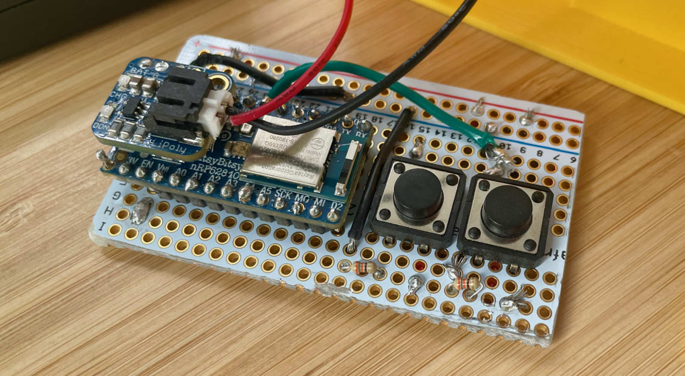
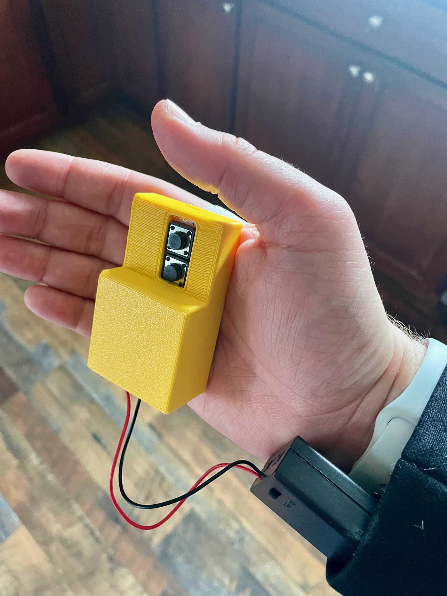

I play french horn in a community and have been slowly making the transition from paper sheet music to going all digital. The problem is as a horn player, I use both hands so it's a pain to reach up and turn the page with my finger. I could always buy a foot pedal, but being a horn player I've got this advantage that my hand is totally hidden in the bell of my horn. So I decided to see if I could make a device that would fit in my hand within the bell, hidden from site, and turn pages for me. 

## The Hardware

The hardware on this is pretty straight forward and consists of:

* [An Adafruit ItsyBitsy nRF52840 Express - Bluetooth LE](https://www.adafruit.com/product/4481)
* [Two tactile buttons](https://www.adafruit.com/product/1119)
* A couple of resistors for the buttons
* Some wiring and a proto board to wire it all together.
* Custom 3D printed case
* Battery pack
* Some elastic to hold the thing around my hand

**NOTE:** If I was to do this again, I would opt for a custom PCB vs the proto board I used. It would've made the entire package a lot cleaner and smaller. I'd also opt for a lipo battery which would've been a lot smaller and lighter as well, but this is what I had on hand. Here's to a v2 with those changes.

## The Software

You can find the code over at [https://github.com/stevenquinn/bluetooth-page-turner](https://github.com/stevenquinn/bluetooth-page-turner). The basics of it are that:

* When the device is powered on, it starts broadcasting as a bluetooth device.
* When connected, it pretends to be a bluetooth keyboard
* The buttons will send either the arrow left or arrow right keys to the connected device which will within the ForScore app, turn the page.

## Putting it together

The case was designed in Shapr3D and is pretty clunky, but it works. Hopefully a later version with a smaller PCB will let me scale all of this down to something more manageable. The back of the case is snap fit and the entire thing attaches to my hand with an elastic strap.