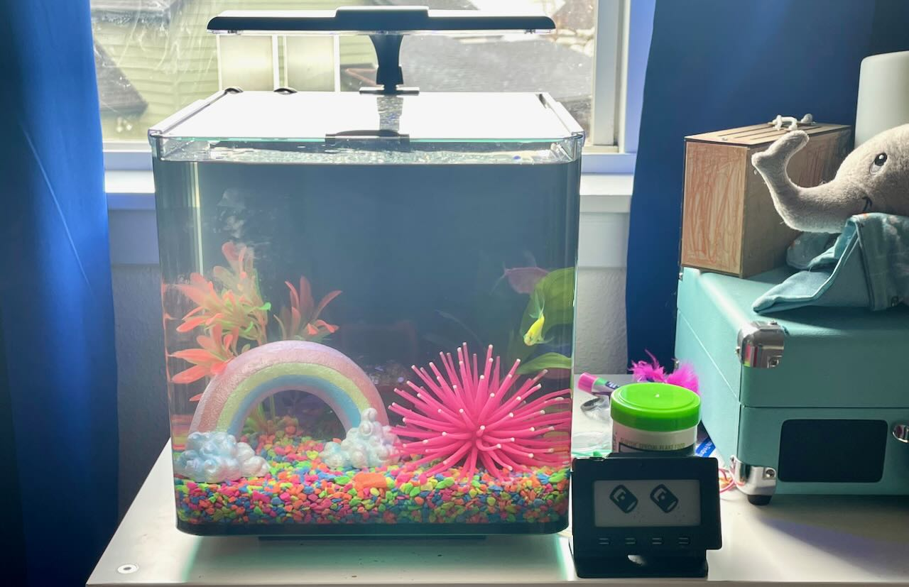
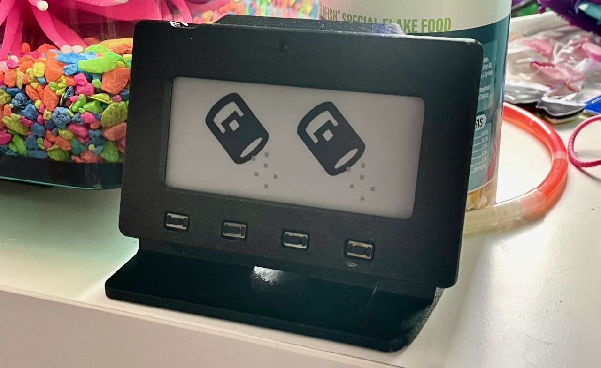

For her 5th birthday, my daughter got a fish tank. She loves it and has been taking care of it herself. She feeds the fish every day and has been doing a great job. But she's been having a hard time keeping track of how much food she's feeding them. So I decided to build her a fish feeder tracker that's easy enough for a 5 year old to use (and mom and dad to check on).

Luckily for us, I had an [Adafruit Magtag](https://learn.adafruit.com/adafruit-magtag) microcontroller. This is a microcontroller that has a 2.9" e-ink display, a speaker, and a battery. It's perfect for this project. I also used [this awesome file](https://learn.adafruit.com/magtag-3d-printed-stand-case/3d-printing) from Adafruit to print an enclosure for it. With it being all in one having a display and buttons already included, there was no real assembly required. Just slap it in the enclosure and go.

The important part of this was the software driving it. The code for this is publicly available and can be found in the Github Project [fish-feeding-tracker](https://github.com/stevenquinn/fish-feeding-tracker). Check out the `main.py` file for the full implementation but the basics go:

* The display starts out with two feed food icons — one for feeding them in the morning, the other for the evening.
* When you press ANY button on the Magtag, one of the icons will be replaced with a thumbs up icon.
* Press it a second time, and the other icon will be replaced with a thumbs up icon.
* The whole thing resets at overnight and is ready to start again the next day.

So far, it's been incredibly successful. My daughter loves it and it's been a great way to help her keep track of how much food she's feeding the fish. 