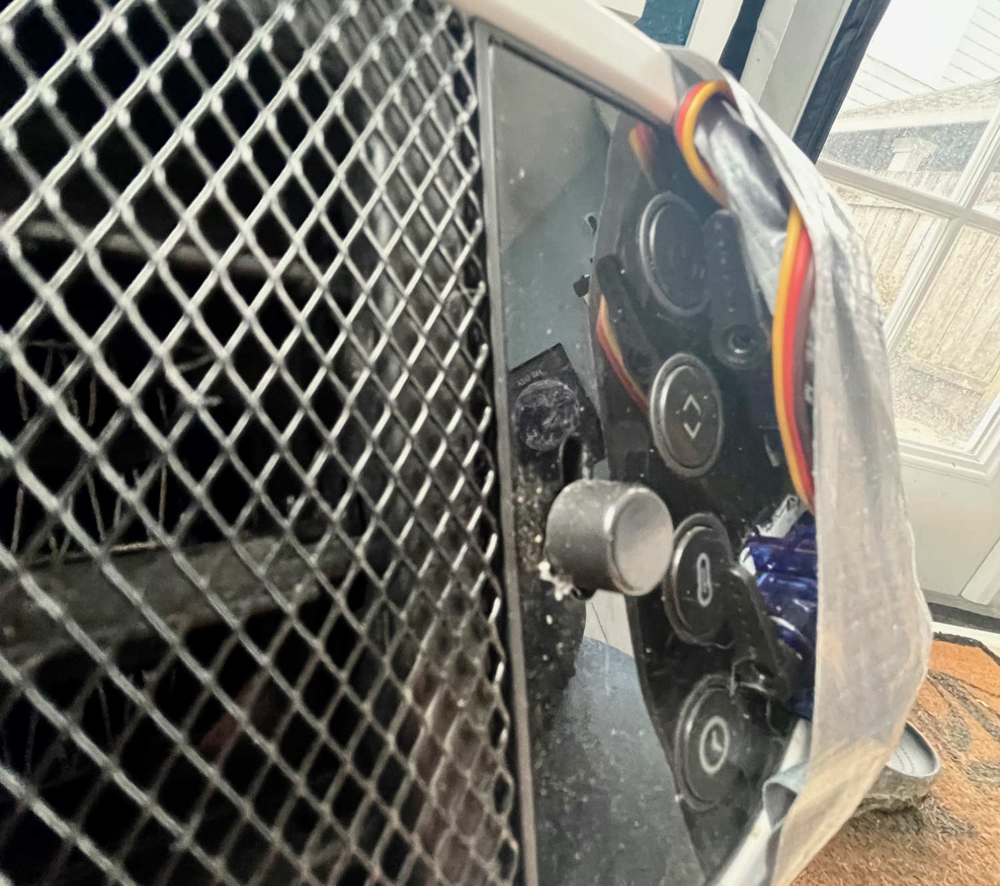
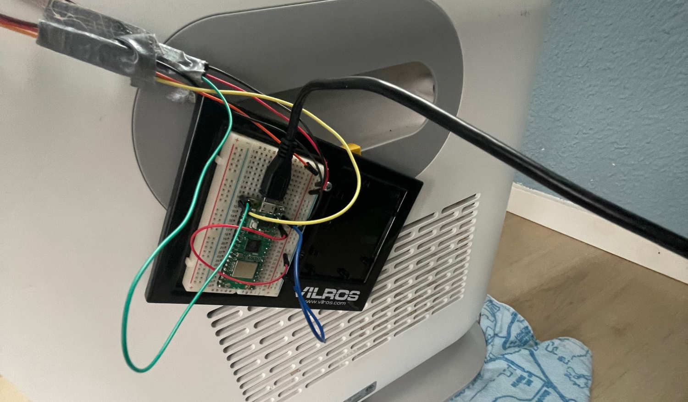

I work remote and have a great little she shed in the backyard. I love it, and it gives me a great dedicated office space during the day. But, it gets pretty cold during the winter. I've got a 1500 watt heater in there, but it takes a while to get warm. My morning routine involved walking out there and turning it on, heading back to the house and waiting for it to get warm, and then walking back out there. I got tired of that, so I decided to make it smart.

<blockquote class="twitter-tweet">
A <a href="https://twitter.com/Raspberry_Pi?ref_src=twsrc%5Etfw">@Raspberry_Pi</a> pico W, couple of servos, and a custom written iPhone app and I can remotely start my backyard office heater so it’s warm before I get out there now! <a href="https://t.co/htn6DacC7u">pic.twitter.com/htn6DacC7u</a>
&mdash; Steven Quinn (@stevenquinn) <a href="https://twitter.com/stevenquinn/status/1619372557244977152?ref_src=twsrc%5Etfw">January 28, 2023</a></blockquote>

## Adding some smarts

I decided to use a [Raspberry Pi Pico W](https://www.adafruit.com/product/5526) as the main controller for the heater. They've got Wifi and bluetooth built in, and are incredible cheap. My heater is a [Honeywell Thermawave 6](https://www.amazon.com/Honeywell-ThermaWave-Ceramic-Technology-Heater/dp/B0977QFH5X/ref=sxts_rp_s_a_1_0). As probably a safety feature, you can't do something like hook this up to a smart plug to remotely turn it on and off. Instead, it needs to be plugged in, and then the front power button needs to be physically pressed.

In comes a couple of servos. I've got a couple of micro servos attached to the front plate (yes, that's duct tape, it works) that are wired to the Raspberry Pi Pico W. When activated, the servos turn to hit the button, and then reset. I've got one for the power button, and the other for the button that controls the temperature. 

## The Raspberry Pi Pico W Code

The code is pretty straight forward and written in Python. You can find the repo for it at [https://github.com/stevenquinn/smart-heater](https://github.com/stevenquinn/smart-heater). Here's what's going on in a nutshell:

* On boot, the Raspberry Pi Pico W connects to the local Wifi network
* It starts a simple local web servo that listens for HTTP requests
* There are three different endpoints setup: one to ping the device to make sure it's connected, one to trigger the on/off servo, and one to trigger the temperature servo
* There's no feedback from the heater itself so there's also no endpoint feedback on whether the heater is on or off

## Controlling it with my phone

For this to work remotely, I needed to be able to control it from my phone. I ended up writing a small custom iPhone app, written in React Native and sideloaded onto my phone as a development app. You can find that code at [https://github.com/stevenquinn/heater-rn-app](https://github.com/stevenquinn/heater-rn-app). This app:

* On boot, pings the Raspberry Pi Pico W to make sure it's connected. If it isn't, it displays a notice. Otherwise, it shows you a couple of on screen buttons.
* The on/off button triggers an HTTP request to the Raspberry Pi Pico W to turn the heater on or off
* The temperature button triggers an HTTP request to the Raspberry Pi Pico W to change the temperature